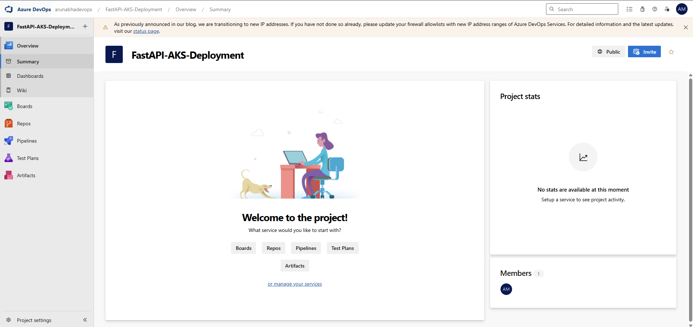
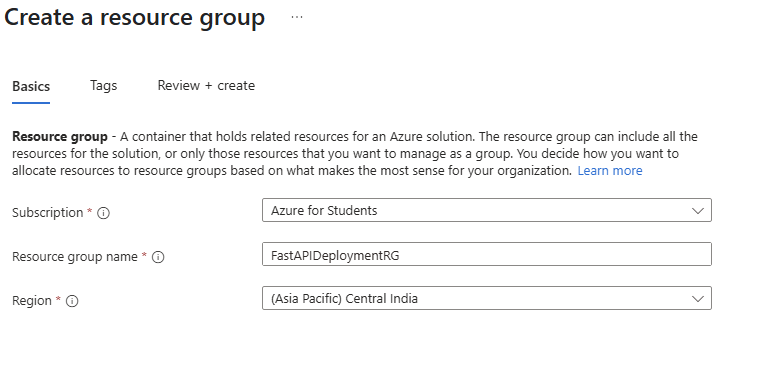
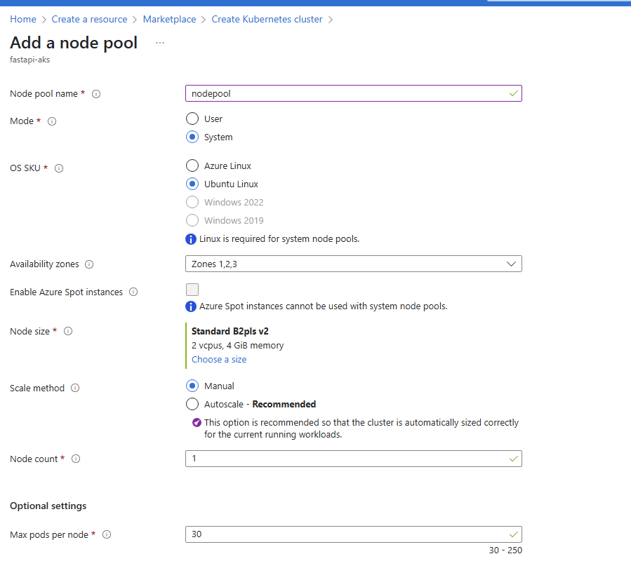

# Azure Kubernetes Service (AKS) Deployment with Azure DevOps CI/CD

## Prerequisites

Before you begin, ensure you have the following:

a- **Azure DevOps Account:** You need access to an Azure DevOps organization and project.
- **Azure Subscription:** You must have access to Azure resources like AKS and Azure Container Registry (ACR).
- **Source Code:** A code repository (e.g., Git) for your application is required.

## High-Level Architecture Overview

The process involves a developer checking in code, which triggers a build pipeline. This pipeline creates artifacts that are then used by a release pipeline to deploy to a production workspace. Azure DevOps Repos manage the source code, including feature and main branches, and pull requests. Azure Container Registry stores the container images, which are then deployed to Azure Kubernetes Service.

## 1. FastAPI Project Source Code

Create a folder named `fastapi-app` and inside it, create a file named `main.py` and `requirements.txt`.

### fastapi-app/main.py

```python
from fastapi import FastAPI
import uvicorn
import os

app = FastAPI()

@app.get("/")
def read_root():
    return {"message": "Hello from FastAPI!"}

if __name__ == "__main__":
    port = int(os.environ.get("PORT", 8080))
    print(f"Listening on port {port}")
    uvicorn.run(app, host="0.0.0.0", port=port)
```

### fastapi-app/requirements.txt

```txt
fastapi==0.111.0
uvicorn==0.30.1
```

## 2. Dockerfile for the FastAPI Project

Create a file named `Dockerfile` in the root of your `fastapi-app` folder (the same level as `main.py` and `requirements.txt`).

### fastapi-app/Dockerfile

```dockerfile
# Use an official Python runtime as a parent image
FROM python:3.9-slim-buster

# Set the working directory in the container
WORKDIR /app

# Copy the current directory contents into the container at /app
COPY ./requirements.txt /app/requirements.txt

# Install any needed packages specified in requirements.txt
RUN pip install --no-cache-dir -r requirements.txt

# Copy the rest of the application code
COPY . /app

# Make port 8080 available to the world outside this container
EXPOSE 8080

# Run the uvicorn server when the container starts
CMD ["python", "main.py"]
```

## 3. Kubernetes Manifest (Deployment and Service)

Create a folder named `kubernetes-manifests` at the root of your project (alongside `fastapi-app`). Inside this folder, create a file named `fastapi-deployment.yaml`.

### kubernetes-manifests/fastapi-deployment.yaml

```yaml
apiVersion: apps/v1
kind: Deployment
metadata:
  name: fastapi-app-deployment
  labels:
    app: fastapi-app
spec:
  replicas: 1 # You can scale this up
  selector:
    matchLabels:
      app: fastapi-app
  template:
    metadata:
      labels:
        app: fastapi-app
    spec:
      containers:
      - name: fastapi-app
        image: <YOUR_ACR_NAME>.azurecr.io/fastapi-app:$(Build.BuildId) # This will be replaced by Azure DevOps
        ports:
        - containerPort: 8080
        env:
        - name: PORT
          value: "8080"
---
apiVersion: v1
kind: Service
metadata:
  name: fastapi-app-service
spec:
  selector:
    app: fastapi-app
  ports:
    - protocol: TCP
      port: 80 # Service will listen on port 80
      targetPort: 8080 # Target the container's port 8080
  type: LoadBalancer # Exposes the service externally
```

**Important:** Remember to replace `<YOUR_ACR_NAME>` with the actual name of your Azure Container Registry (e.g., `myfastapicr`). The `$(Build.BuildId)` variable will be automatically populated by Azure DevOps with the build number.

## Project Structure Summary

```
your-azure-devops-repo/
├── fastapi-app/
│   ├── main.py
│   ├── requirements.txt
│   └── Dockerfile
└── kubernetes-manifests/
    └── fastapi-deployment.yaml
```

## Azure DevOps CI/CD Implementation

### 1. Project Description

The goal is to automate the deployment of a containerized FastAPI application (listening on port 8080) to Azure Kubernetes Service (AKS) using Azure DevOps pipelines, ensuring high availability, scalability, and reliability for an e-commerce platform.

### 2. Prerequisites

Before you begin, ensure you have the following:

- **Azure DevOps Account:** Access to an Azure DevOps organization and a project.
- **Azure Subscription:** An active Azure subscription with permissions to create and manage resources like Azure Kubernetes Service (AKS) and Azure Container Registry (ACR).
- **Source Code Repository:** A Git repository in Azure DevOps Repos containing your FastAPI application's source code (`main.py`, `requirements.txt`, `Dockerfile`) and Kubernetes manifest files (`fastapi-deployment.yaml`).

### 3. High-Level Architecture

The deployment process follows a Continuous Integration/Continuous Deployment (CI/CD) model:

1. **Developer Code Check-in:** Developers push code changes to Azure DevOps Repos (Git).
2. **Build Pipeline (CI):** Triggered by code changes, this pipeline builds the Docker image for the FastAPI app, pushes it to Azure Container Registry (ACR), and publishes deployment artifacts.
3. **Release Pipeline (CD):** Consumes the artifacts from the build pipeline and deploys the containerized FastAPI application to Azure Kubernetes Service (AKS).

### 4. CI/CD Process Steps

Follow these steps to set up your CI/CD pipeline for the FastAPI application:

#### Step 4.1: Create Azure Resources

First, set up the necessary infrastructure in Azure using either the Azure Portal or Azure CLI.

##### Method 1: Azure Portal

1. **Create a Resource Group:**
   - Go to the Azure Portal ([portal.azure.com](https://portal.azure.com)).
   - Search for "Resource groups" in the search bar and select it.
   - Click on **+ Create** at the top.
   - On the "Create a resource group" page, provide:
     - **Subscription:** Select your Azure subscription.
     - **Resource group name:** Enter a unique name (e.g., `FastAPIDeploymentRG`).
     - **Region:** Choose an Azure region closest to you (e.g., `East US`).
   - Click **Review + create** and then **Create**.
   

2. **Create an Azure Container Registry (ACR):**
   - In the Azure Portal, search for "Container Registries" and select it.
   - Click on **+ Create** at the top.
   - On the "Create container registry" page, provide:
     - **Subscription:** Select your Azure subscription.
     - **Resource group:** Choose the resource group you created (e.g., `FastAPIDeploymentRG`).
     - **Registry name:** Enter a globally unique name for your ACR (e.g., `myfastapicr`).
     - **Location:** Choose the same region as your resource group.
     - **SKU:** Select a SKU (e.g., `Basic` for development/testing, `Standard` for production features).
   - Go to the **Networking** tab, ensure default public access.
   - Go to the **Security** tab, consider enabling "Admin user" for simplicity during initial setup, but disable it for production.
   - Click **Review + create** and then **Create**.

3. **Create an Azure Kubernetes Service (AKS) Cluster:**
   - In the Azure Portal, search for "Kubernetes services" and select it.
   - Click on **+ Create** > **Create a Kubernetes cluster**.
   - On the "Create a Kubernetes cluster" page, configure the following tabs:
     - **Basics:**
       - **Subscription:** Select your Azure subscription.
       - **Resource group:** Choose your created resource group (e.g., `FastAPIDeploymentRG`).
       - **Kubernetes cluster name:** Enter a name for your cluster (e.g., `fastapi-aks`).
       - **Region:** Choose the same region as your resource group.
       - **Kubernetes version:** Select a recommended version.
       - **Node pools:**
         - For **Node size**, you can start with a small size (e.g., `Standard_DS2_v2`).
         - For **Scale method**, choose `Manual`.
         - For **Node count**, start with `1` or `2` for a basic setup.
     - **Networking:**
       - Choose your desired network configuration (e.g., `Kubenet` for simplicity, `Azure CNI` for advanced scenarios).
     - **Integrations:**
       - Ensure **Azure Container Registry** is selected and choose your created ACR (e.g., `myfastapicr`) from the dropdown. This step is crucial as it automatically configures your AKS cluster to pull images from your ACR.
     - **Monitoring, Tags, etc.:** Review these tabs and configure as needed.
   - Click **Review + create** and then **Create**. The deployment of an AKS cluster can take several minutes.

#### Step 4.2: Assign Specific Roles

After creating your resources, ensure the service principal used by your Azure DevOps service connection has the necessary permissions. While `--attach-acr` largely handles image pull permissions for AKS, you might need to explicitly assign the "AcrPush" role to the service principal used by your Azure DevOps service connection for pushing images to ACR, especially if you set up the service connection manually.

To assign the "AcrPush" role:
1. Go to your ACR instance in the Azure Portal.
2. Navigate to **Access control (IAM)**.
3. Click **+ Add** > **Add role assignment**.
4. Search for and select the **AcrPush** role.
5. For **Members**, search for the Service Principal associated with your Azure DevOps Service Connection (it often has a name like `AzureDevOps <your-project-name>`).
6. Click **Review + assign**.

#### Step 4.3: Set Up Service Connection in Azure DevOps

1. In your Azure DevOps project, navigate to **Project settings** (bottom-left corner) > **Service connections**.
2. Click **+ New service connection**.
3. Select **Azure Resource Manager** and click **Next**.
4. Choose **Service principal (automatic)** for the simplest setup. If automatic fails or you need more control, select `Service principal (manual)` and provide your service principal details. Click **Next**.
5. Select your **Subscription** and the **Resource group** you created (e.g., `FastAPIDeploymentRG`).
6. Provide a **Service connection name** (e.g., `AzureServiceConnection`). This name will be used in your pipeline YAML.
7. Click **Save**.

#### Step 4.4: Upload Your Project to Azure DevOps Repo

Upload the `fastapi-app` and `kubernetes-manifests` folders to your Azure DevOps Git repository, maintaining the described structure:

```
your-azure-devops-repo/
├── fastapi-app/
│   ├── main.py
│   ├── requirements.txt
│   └── Dockerfile
└── kubernetes-manifests/
    └── fastapi-deployment.yaml
```

#### Step 4.5: Create a Continuous Integration (CI) Pipeline (Build Pipeline)

This pipeline will build your Docker image and publish your Kubernetes manifests as artifacts.

1. In Azure DevOps, go to **Pipelines** > **Pipelines** and click **New pipeline**.
2. Select your repository where the FastAPI project code resides.
3. Choose `Starter pipeline` to begin with a blank YAML file.
4. Replace the default YAML content with the following. Name this pipeline `FastAPI-CI-Pipeline`.

   ```yaml
   # CI Pipeline for FastAPI Application
   trigger:
     - main # Trigger on pushes to the main branch

   pool:
     vmImage: 'ubuntu-latest' # Use a Microsoft-hosted Ubuntu agent

   stages:
   - stage: Build
     displayName: 'Build and Push Docker Image'
     jobs:
     - job: BuildJob
       displayName: 'Build and Push'
       steps:
       - task: Docker@2
         displayName: 'Build FastAPI Docker Image'
         inputs:
           command: 'build'
           containerRegistry: 'AzureServiceConnection' # Use the name of your service connection from Step 4.3
           repository: 'fastapi-app' # The name for your Docker image repository in ACR (e.g., 'fastapi-app')
           dockerfile: 'fastapi-app/Dockerfile' # Path to your Dockerfile within the repo
           tags: '$(Build.BuildId)' # Tag your image with the Azure DevOps build ID

       - task: Docker@2
         displayName: 'Push FastAPI Docker Image'
         inputs:
           command: 'push'
           containerRegistry: 'AzureServiceConnection'
           repository: 'fastapi-app'
           tags: '$(Build.BuildId)'
           # Ensure the service connection has 'AcrPush' role on your ACR

       - task: CopyFiles@2
         displayName: 'Copy Kubernetes Manifests'
         inputs:
           contents: 'kubernetes-manifests/*.yaml' # Path to your Kubernetes manifests folder
           targetFolder: '$(Build.ArtifactStagingDirectory)/manifests' # Copy them to the staging directory

       - task: PublishBuildArtifacts@1
         displayName: 'Publish Kubernetes Manifests Artifact'
         inputs:
           pathToPublish: '$(Build.ArtifactStagingDirectory)/manifests'
           artifactName: 'kubernetes_manifests' # Name of the artifact to be consumed by CD pipeline
   ```

5. Click **Save and run** to commit the `azure-pipelines.yml` file to your repository and start the first build. Ensure it completes successfully.

#### Step 4.6: Create a Continuous Deployment (CD) Pipeline (Release Pipeline)

This pipeline will deploy the built Docker image using the Kubernetes manifests to your AKS cluster.

1. In Azure DevOps, go to **Pipelines** > **Releases** and click **New pipeline**.
2. Select a template, or start with an **Empty job**.
3. **Add an Artifact:**
   - Click on **+ Add an artifact** box on the left.
   - Select **Build** as the source type.
   - For **Project**, select your Azure DevOps project.
   - For **Source (build pipeline)**, select your CI pipeline (e.g., `FastAPI-CI-Pipeline`).
   - For **Default version**, choose `Latest`.
   - For **Source alias**, you can keep the default (e.g., `_FastAPI-CI-Pipeline`). This will be part of the path to your artifacts.
   - Enable the **Continuous deployment trigger** (the lightning bolt icon on the artifact box) to automatically create a new release when a new build artifact is available.
   - Click **Add**.

4. **Configure Stages:**
   - Hover over "Stage 1" and click the **pencil icon** to rename it (e.g., "Deploy FastAPI to AKS").
   - Click on the **1 job, 0 task** link within your stage.
   - Under **Agent job**, ensure the Agent pool is set to `Azure Pipelines` and the Agent Specification is `ubuntu-latest` or similar.

5. **Add Deployment Task:**
   - Click on the **+** icon next to "Agent job" to add a new task.
   - Search for "Kubernetes" and select the **KubernetesManifest@1** task.
   - Configure the task inputs:
     - **Display name:** `Deploy FastAPI to AKS`
     - **Action:** `deploy`
     - **Kubernetes service connection:** Select the Azure service connection you created (e.g., `AzureServiceConnection`).
     - **Namespace:** Enter the Kubernetes namespace where you want to deploy (e.g., `default`).
     - **Manifests:** Click the "..." button to browse for your manifest file. Navigate to `_FastAPI-CI-Pipeline/kubernetes_manifests/fastapi-deployment.yaml`. The `_FastAPI-CI-Pipeline` part comes from your artifact source alias.
     - Leave other settings as default for now.

6. **Save and Create Release:**
   - Click **Save** in the top right corner.
   - Click **Create release** in the top right corner. Select the latest version of your build artifact and click **Create**.
   - Monitor the release pipeline execution to ensure successful deployment.

Once deployed, AKS will create a LoadBalancer service, and you can get the external IP address of your FastAPI application by running `kubectl get service fastapi-app-service` in your AKS cluster. You can then access your application via that IP address on port 80.
